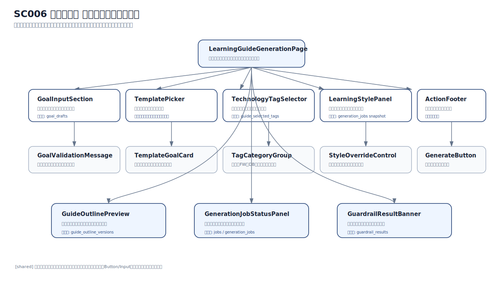
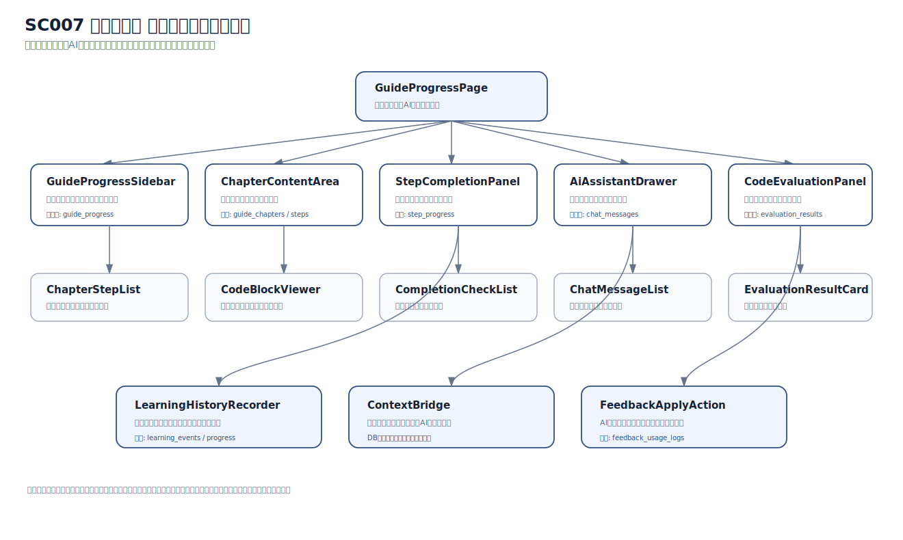
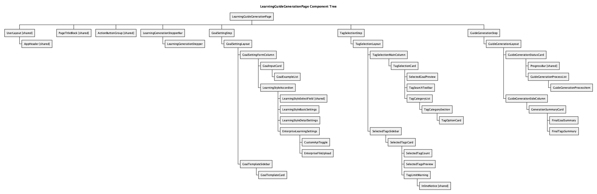
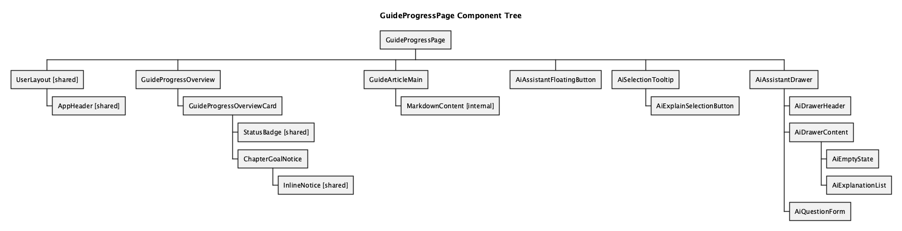

# 05 コンポーネントツリー図

## 目的

コンポーネントツリー図は、画面を React で実装するときに、UIをどの単位へ分けるかを整理する設計図です。  
Metis では、AI生成、進捗更新、AI相談、コード評価、教材化など、1画面内に複数の責務が入りやすいため、画面を適切な粒度で分割しておく必要があります。

本ページでは、コア画面の分割方針と、代表画面のコンポーネントツリーを示します。

補足説明画像は `docs/assets/component-tree/` に置いています。  
`metis` リポジトリで実際に使用している画像は、`docs/assets/metis/component-tree/` に配置しています。

!!! note "画像の確認方法"
    ページ上の画像はクリックすると拡大表示できます。  
    画像直下のリンクから、画像ファイル単体やGitHub上の実ファイルも確認できます。

---

## 分割粒度

コンポーネント分割は、細かいボタンやラベル単位ではなく、画面の責務が分かる単位を基準にします。

| 粒度 | 例 | 確認すること |
|---|---|---|
| レイアウト単位 | `UserLayout`, `AdminLayout`, `AppHeader`, `AdminHeader` | 画面共通のヘッダーや枠組みを共通化できているか |
| ページ単位 | `HomePage`, `GuideProgressPage`, `MaterialDetailPage` | 1画面の責務が大きすぎないか |
| セクション単位 | `GoalInputSection`, `ChapterContentArea`, `ReviewSummarySection` | 画面内の情報のまとまりが自然か |
| パネル・カード単位 | `AiAssistantDrawer`, `ProgressCard`, `MaterialSummaryCard` | 表示情報が分かりやすく分かれているか |
| モーダル・ドロワー単位 | `ConfirmDialog`, `AiDrawer`, `AdminActionPanel` | 常時表示する情報と必要時だけ開く情報が分かれているか |

`Button`、`Input`、`Label`、`Icon` のような細かいUI部品は、ここでは主対象にしません。  
この段階では、画面の責務分割、データの受け渡し、状態管理の境界を確認します。

---

## 共通コンポーネントの考え方

ツリー図では `[shared]` が付いたノードを、複数画面で再利用する候補として扱います。

| 共通候補 | 用途 | 確認すること |
|---|---|---|
| `UserLayout [shared]` | 認証画面以外の利用者向け画面の共通レイアウト | ヘッダー、検索、カート、マイページ導線が共通化できるか |
| `AdminLayout [shared]` | 管理者向け画面の共通レイアウト | 管理者ヘッダー、監査ログ導線、ユーザー画面へ戻る導線が共通化できるか |
| `PageTitleBlock [shared]` | ページタイトル・説明文 | 画面ごとの目的が最初に分かるか |
| `AiAssistantDrawer [shared]` | AI相談パネル | ガイド進行、教材閲覧、コード評価で再利用できるか |
| `JobStatusPanel [shared]` | 非同期処理の進捗表示 | 生成、評価、教材化、エクスポートなどで状態表現を揃えられるか |

!!! warning "注意"
    `[shared]` は共通化候補の目印です。  
    実装時には、props・状態管理・CSS・アクセシビリティを見て最終判断します。

---

## コア画面ごとの分割方針

### SC006 ガイド生成

ガイド生成画面は、利用者が「作りたいもの」を入力し、タグや学習方針を選び、AI生成を開始する画面です。  
入力、確認、生成状態が1画面に集まるため、入力領域と非同期処理の状態表示を分けます。

| 領域 | 目的 | 対応する主なデータ |
|---|---|---|
| ゴール入力領域 | 利用者が作りたいものを入力する | `GOAL_DRAFTS` |
| テンプレート選択領域 | 初学者が入力に迷わないように例を出す | テンプレート定義、下書き反映 |
| タグ選択領域 | 使用技術や学習対象を選ぶ | `TECHNOLOGY_TAGS`, `GENERATION_JOB_TAGS` |
| 学習スタイル設定領域 | 難易度・説明粒度・学習方向を調整する | `LEARNING_STYLE_DEFAULTS`, `GENERATION_JOBS` |
| 構成案確認領域 | 生成前にガイド構成を確認する | `GUIDE_OUTLINES` |
| 生成進捗領域 | AI生成中の状態、失敗、再試行を表示する | `JOBS`, `GENERATION_JOBS`, `GUARDRAIL_RESULTS` |

確認する流れは、**入力 → 構成案確認 → 生成 → 学習開始** です。

### SC007 ガイド進行

ガイド進行画面は、学習本文、進捗、AI相談、コード評価が集まる画面です。  
「読む」「進める」「相談する」「評価する」が同時に起きるため、表示領域と操作領域を明確に分けます。

| 領域 | 目的 | 対応する主なデータ |
|---|---|---|
| 章・ステップ一覧 | 現在位置と進捗を確認する | `GUIDE_CHAPTERS`, `GUIDE_STEPS`, `GUIDE_PROGRESS` |
| 本文表示領域 | 学習内容を読む | `GUIDE_CHAPTERS`, `GUIDE_STEPS` |
| コードブロック領域 | コード例やコピー操作を扱う | 本文内コード、コピー操作ログ |
| 完了チェック領域 | ステップ完了、次章への進行を扱う | `STEP_PROGRESS`, `CHAPTER_PROGRESS` |
| AI相談パネル | 質問・回答・文脈付き相談を扱う | `CHAT_MESSAGES`, `AI_EXECUTIONS` |
| コード評価領域 | 実行評価・品質評価・改善提案を扱う | `EVALUATION_JOBS`, `EVALUATION_RESULTS` |

確認する流れは、**本文を読む → ステップ完了 → AI相談・コード評価 → 次章へ進む** です。

### SC008 学習ガイド終了

ガイド終了画面では、完了結果・AI評価・改善提案・教材化導線を分けて見せます。

| 領域 | 目的 | 対応する主なデータ |
|---|---|---|
| 完了サマリー | 完了したガイド、学習時間、進捗率を表示する | `GUIDE_COMPLETIONS` |
| AI評価サマリー | 総合評価と評価コメントを表示する | `AI_EVALUATION_SUMMARIES` |
| 改善提案 | 次に伸ばすポイントを表示する | `EVALUATION_RESULTS` |
| 教材化導線 | 完了済みガイドから教材作成へ進む | `MATERIAL_CREATION_JOBS` |
| 復習導線 | ガイドに戻って復習する | `GUIDES`, `GUIDE_PROGRESS` |

確認する流れは、**完了結果を確認する → 評価を読む → 教材化または復習へ進む** です。

### SC009 教材詳細

教材詳細画面は、教材の閲覧、学習開始、レビュー、作者操作が集まる画面です。

| 領域 | 目的 | 対応する主なデータ |
|---|---|---|
| 教材概要 | タイトル、説明、価格、作者、評価を表示する | `MATERIALS`, `MATERIAL_VERSIONS` |
| 学習内容・目次 | 教材の章やレッスン構成を表示する | `MATERIAL_SECTIONS`, `MATERIAL_CHAPTERS` |
| 購入・学習開始導線 | 未購入・購入済み・作者で表示を切り替える | 利用権限、学習履歴 |
| レビュー領域 | 評価・コメント・レビュー集計を表示する | レビュー、レビュー集計 |
| 作者向け操作 | 公開状態、作者メモ、エクスポートなどを扱う | `MATERIALS`, 作者メモ、出力ジョブ |

確認する流れは、**教材概要を確認する → 目次を見る → 学習開始または購入判断をする** です。

---

## 補足説明画像

### SC006 ガイド生成

この図は、ゴール入力・タグ選択・学習スタイル設定・生成状態表示の分割を示します。

画像ファイル: [サイトで開く](../assets/component-tree/learning-guide-generation-page.svg) / [GitHubで確認](https://github.com/5B-Projects/review_Repository/blob/main/docs/assets/component-tree/learning-guide-generation-page.svg)

### SC007 ガイド進行

この図は、学習本文・進捗・AI相談・コード評価の分割を示します。

画像ファイル: [サイトで開く](../assets/component-tree/guide-progress-page.svg) / [GitHubで確認](https://github.com/5B-Projects/review_Repository/blob/main/docs/assets/component-tree/guide-progress-page.svg)

---

## metisで使用している画像

以下は、`5B-Projects/metis` の `docs/design/05-component-tree/image/` で使用しているPNG画像です。

### SC006 ガイド生成

画像ファイル: [サイトで開く](../assets/metis/component-tree/learning-guide-generation-page.png) / [GitHubで確認](https://github.com/5B-Projects/review_Repository/blob/main/docs/assets/metis/component-tree/learning-guide-generation-page.png) / [metisの元画像](https://github.com/5B-Projects/metis/blob/develop/docs/design/05-component-tree/image/learning-guide-generation-page.png)

### SC007 ガイド進行

画像ファイル: [サイトで開く](../assets/metis/component-tree/guide-progress-page.png) / [GitHubで確認](https://github.com/5B-Projects/review_Repository/blob/main/docs/assets/metis/component-tree/guide-progress-page.png) / [metisの元画像](https://github.com/5B-Projects/metis/blob/develop/docs/design/05-component-tree/image/guide-progress-page.png)

---

## 確認観点

1. 画面の情報が自然なまとまりで分かれているか。
2. 共通化すべき部分と画面固有にすべき部分が分かれているか。
3. コア画面の責務が大きくなりすぎていないか。
4. AI相談・AI評価・教材化の領域が画面上で混ざりすぎていないか。
5. 画面データ要求と対応する保存先が説明できる粒度になっているか。
6. 実装時にReactコンポーネントとして切り出しやすい粒度か。
