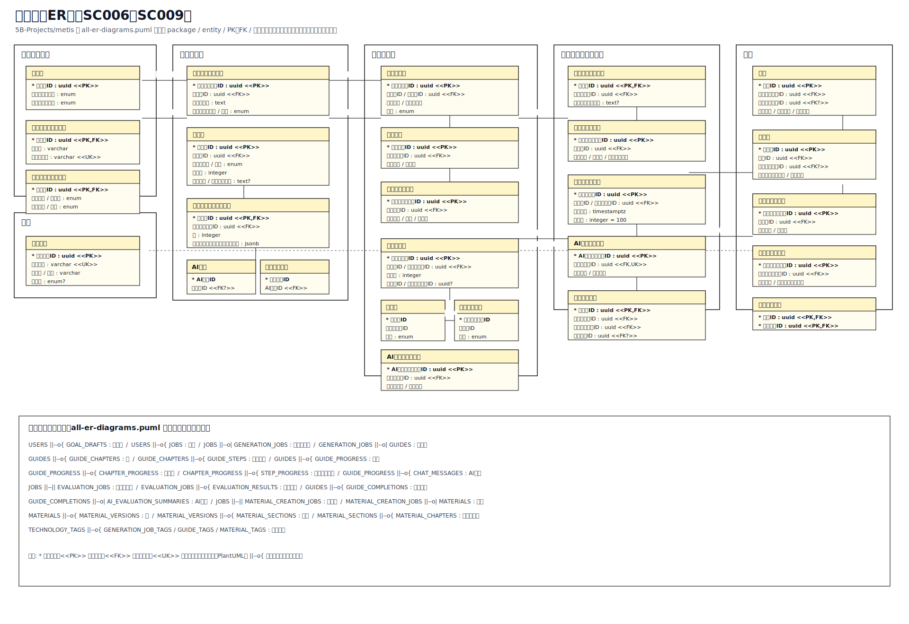
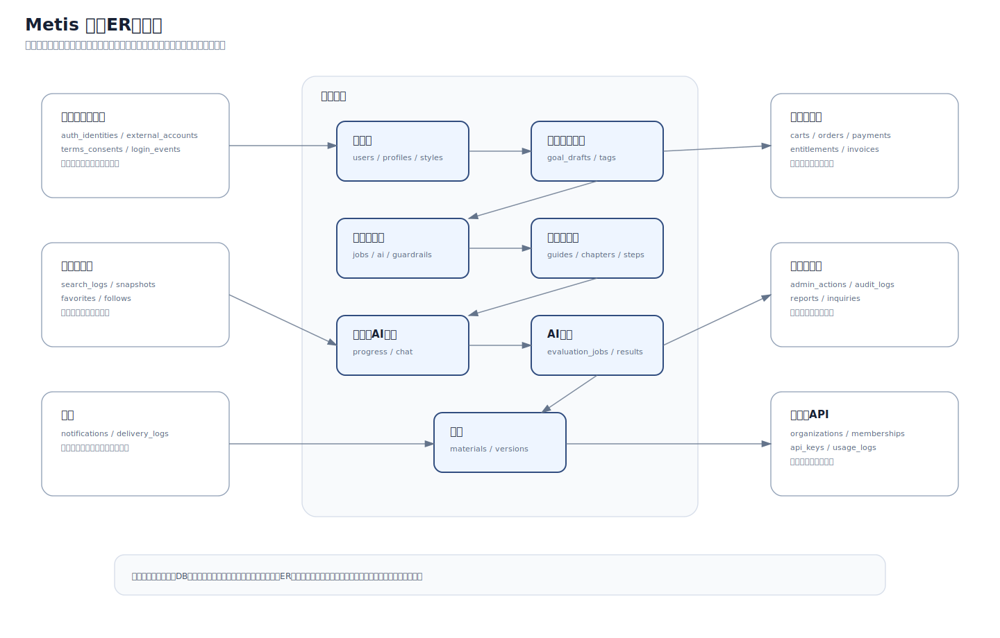

# 07 ER図

## 位置づけ

`docs/design/07-er/` は、画面データ要求書から導いたER図を管理する設計図です。

このページでは、最初に **コア範囲だけのER図** を表示し、その後に全体ERの概要を置きます。  
全画面統合ER図は情報量が多いため、初回レビューではコア体験を先に確認し、周辺領域は影響範囲として扱います。

コア範囲ER図は、`metis` リポジトリの `docs/design/07-er/all-er-diagrams.puml` と同じ書き方に合わせ、`package`、`entity`、`PK/FK`、PlantUMLのリレーション記法で作っています。

!!! note "画像の確認方法"
    ページ上の画像はクリックすると拡大表示できます。  
    画像直下のリンクから、画像ファイル単体、GitHub上の実ファイル、対応する `.puml` ソースを確認できます。

---

## コア範囲ER図

初回レビューでは、以下の流れに必要なテーブルだけを見ます。

```text
利用者
  ↓
ゴール入力
  ↓
ガイド生成
  ↓
ガイド進行
  ↓
AI相談・評価
  ↓
ガイド完了
  ↓
教材化
  ↓
教材
```

[](../assets/er/core-er-diagram.svg)

画像ファイル: [サイトで開く](../assets/er/core-er-diagram.svg) / [GitHubで確認](https://github.com/5B-Projects/review_Repository/blob/main/docs/assets/er/core-er-diagram.svg)  
PlantUMLソース: [サイトで開く](../assets/er/core-er-diagram.puml) / [GitHubで確認](https://github.com/5B-Projects/review_Repository/blob/main/docs/assets/er/core-er-diagram.puml)

!!! note "この図の目的"
    完全版ER図から、先生レビューで最初に確認したい範囲だけを抜粋した図です。  
    正本を置き換えるものではなく、全体ERを見る前の入口として使います。

---

## 画面との対応

| 画面ID | 画面名 | 主に見るER領域 | 確認したいこと |
|---|---|---|---|
| SC006 | ガイド生成 | 利用者・前提、タグ、ガイド生成 | ゴール下書き、タグ、学習スタイル、生成ジョブ、安全性検査を追跡できるか |
| SC007 | ガイド進行 | ガイド進行、評価・完了・教材化 | 章/ステップ、進捗、AI相談、コード評価を分けて保存できるか |
| SC008 | 学習ガイド終了 | 評価・完了・教材化 | 完了記録、AI評価サマリー、教材化ジョブの境界が明確か |
| SC009 | 教材詳細 | 教材、タグ | 教材、教材版、セクション、チャプター、タグの構造が表示内容に合うか |

---

## コア範囲のエンティティ

| 領域 | 主なテーブル | 役割 | レビュー観点 |
|---|---|---|---|
| 利用者・前提 | `USERS`, `USER_PROFILES`, `LEARNING_STYLE_DEFAULTS` | 利用者の基本情報、プロフィール、学習スタイル既定値を持つ | ガイド生成に必要な利用者属性・学習スタイルが揃っているか |
| タグ | `TECHNOLOGY_TAGS` | ガイド生成、ガイド分類、教材分類で共通利用する技術タグを持つ | タグを生成時・ガイド・教材で使い回せるか |
| ガイド生成 | `GOAL_DRAFTS`, `JOBS`, `GENERATION_JOBS`, `AI_EXECUTIONS`, `GUARDRAIL_RESULTS`, `GENERATION_JOB_TAGS`, `GUIDE_OUTLINES` | AI生成の依頼、状態、実行履歴、安全性検査、構成案を持つ | 非同期処理、失敗、再生成、ブロック理由を追跡できるか |
| ガイド進行 | `GUIDES`, `GUIDE_TAGS`, `GUIDE_CHAPTERS`, `GUIDE_STEPS`, `GUIDE_PROGRESS`, `CHAPTER_PROGRESS`, `STEP_PROGRESS`, `CHAT_MESSAGES` | 生成済みガイド本文、章・ステップ、利用者ごとの進捗、AI相談を持つ | ガイド本文と利用者ごとの進捗を分けて管理できるか |
| 評価・完了・教材化 | `EVALUATION_JOBS`, `EVALUATION_RESULTS`, `GUIDE_COMPLETIONS`, `AI_EVALUATION_SUMMARIES`, `MATERIAL_CREATION_JOBS` | コード評価、完了結果、AI評価、教材化処理を持つ | 評価結果と教材化の根拠を保存できるか |
| 教材 | `MATERIALS`, `MATERIAL_VERSIONS`, `MATERIAL_TAGS`, `MATERIAL_SECTIONS`, `MATERIAL_CHAPTERS` | 公開・閲覧される教材の本体、版、構成を持つ | 完了ガイドから教材として公開・閲覧できる構造か |

---

## 主要な関係の読み方

| 関係 | 読み方 | 設計意図 |
|---|---|---|
| `USERS ||--o{ GOAL_DRAFTS` | 利用者がゴール下書きを作る | 生成前の入力途中状態を保存できるようにする |
| `GOAL_DRAFTS ||--o{ GENERATION_JOBS` | 下書きから生成ジョブを開始する | 入力内容と生成処理を分離し、再生成や失敗を扱いやすくする |
| `JOBS ||--o| GENERATION_JOBS` | 共通ジョブをガイド生成用に拡張する | 進捗率・状態・失敗理由は共通化し、用途固有の値だけ詳細側へ置く |
| `GENERATION_JOBS ||--o| GUIDES` | 生成結果として学習ガイドができる | AI生成の成果物と生成履歴を追跡できるようにする |
| `GUIDES ||--o{ GUIDE_CHAPTERS ||--o{ GUIDE_STEPS` | ガイドを章・ステップへ分割する | 学習画面の表示単位、進捗単位と合わせる |
| `GUIDE_PROGRESS ||--o{ CHAPTER_PROGRESS ||--o{ STEP_PROGRESS` | 進捗を全体・章・ステップで分ける | 全体進捗だけではなく、未完了箇所を復元できるようにする |
| `GUIDE_PROGRESS ||--o{ CHAT_MESSAGES` | そのガイド進行中のAI相談を持つ | AI相談を利用者・ガイド・現在文脈に紐づける |
| `JOBS ||--|| EVALUATION_JOBS` | 共通ジョブをコード評価用に拡張する | 生成ジョブと同じ非同期ジョブ設計で評価を扱う |
| `GUIDE_COMPLETIONS ||--o| MATERIAL_CREATION_JOBS` | 完了済みガイドから教材化する | 未完了ガイドを教材化しない制約を説明しやすくする |
| `MATERIAL_CREATION_JOBS ||--o| MATERIALS` | 教材化処理の結果として教材を作る | 作成途中・失敗・再実行を扱えるようにする |
| `MATERIALS ||--o{ MATERIAL_VERSIONS` | 教材本文は版として管理する | 公開後の更新、差し戻し、検証状態を扱えるようにする |

---

## 保存方針

| データ種別 | DBに保存するもの | DBへ直書きしないもの | 理由 |
|---|---|---|---|
| 画面状態 | 下書き、進捗、完了状態、ジョブ状態 | 一時的な開閉状態、ホバー状態 | 復元や監査が必要な状態だけ保存するため |
| AI入出力 | 実行ID、用途、モデル、入出力パス、要約 | 長い本文そのもの | DB肥大化を避け、Storage側で本文を管理するため |
| ガイド本文 | ガイド、章、ステップの構造情報 | 長大なMarkdown本文の直書き | 構造はDB、本文はStorageに寄せるため |
| 評価結果 | スコア、評価種別、要約、改善項目 | 実行ログ全文 | 画面表示に必要な値と追跡情報を分けるため |
| 教材本文 | 教材、版、セクション、チャプターの構造 | 大きい本文・添付ファイル | 版管理と本文管理を分けるため |

---

## コアから外した範囲

以下は完全版ERには含まれますが、初回レビューでは別紙扱いにします。

| 領域 | 理由 |
|---|---|
| 課金・カート・決済・利用権限 | 教材購入には必要だが、ガイド生成・進行の中核から外れるため |
| 管理者・監査ログ | 運用設計として重要だが、初回レビューでは論点が広がりすぎるため |
| 組織・組織API認証情報 | 将来拡張要素が強いため |
| 通知・フォロー・お気に入り | 利便性・SNS寄り機能のため |
| 検索ログ・検索結果スナップショット | 分析・改善寄りのデータのため |
| 規約同意・外部アカウント連携 | 認証補助として重要だが、コア体験の説明からは外れるため |

---

## metisで実際に使用している全体ER図

以下は、`5B-Projects/metis` の `docs/design/07-er/image/all-er-diagrams.png` で実際に使用している全画面統合ER図です。  
`Sync Metis design images` ワークフローを実行すると、`review_Repository` の `docs/assets/metis/er/` にコピーされます。

[](../assets/metis/er/all-er-diagrams.png)

画像ファイル: [サイトで開く](../assets/metis/er/all-er-diagrams.png) / [GitHubで確認](https://github.com/5B-Projects/review_Repository/blob/main/docs/assets/metis/er/all-er-diagrams.png) / [metisの元画像](https://github.com/5B-Projects/metis/blob/develop/docs/design/07-er/image/all-er-diagrams.png)  
元PlantUML: [metisのall-er-diagrams.puml](https://github.com/5B-Projects/metis/blob/develop/docs/design/07-er/all-er-diagrams.puml)

---

## 全体ER概要

詳細確認が必要な場合だけ、以下の全体ER概要を見ます。  
ここでは全カラムを読むのではなく、コア体験と周辺機能の位置関係を確認します。

[](../assets/er/full-er-overview.svg)

画像ファイル: [サイトで開く](../assets/er/full-er-overview.svg) / [GitHubで確認](https://github.com/5B-Projects/review_Repository/blob/main/docs/assets/er/full-er-overview.svg)

---

## レビュー観点

1. コア機能のデータが、画面データ要求と対応しているか。
2. AI生成・AI評価の入力/出力本文をDBへ直書きしない方針でよいか。
3. ジョブ共通親 `JOBS` とドメイン別詳細テーブルの分割が妥当か。
4. ガイド進捗を `GUIDE_PROGRESS`、`CHAPTER_PROGRESS`、`STEP_PROGRESS` に分ける粒度が妥当か。
5. 教材化ジョブと教材本体の境界が妥当か。
6. 課金・管理者・監査ログを初回レビューから外す判断で問題ないか。
7. コアERだけを見ても、SC006〜SC009の画面表示・入力・保存契機を説明できるか。
