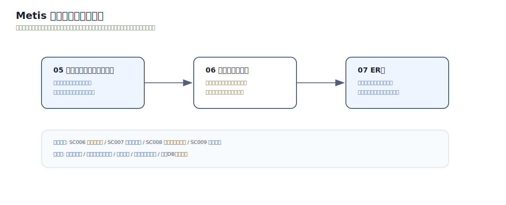

# Metis 設計資料

Metis は、利用者が「作りたいもの」を入力すると、必要な知識・手順・学習順序をAIで整理し、学習ガイドとして進められる教育支援アプリです。  
本資料では、Metis の中核機能である **ガイド生成、ガイド進行、AI相談・評価、教材化、教材閲覧** に絞って、画面設計とデータ設計のつながりを整理します。

---

## 対象範囲

本資料で扱う主な画面は以下です。

| 画面ID | 画面名 | 役割 |
|---|---|---|
| SC006 | ガイド生成 | 利用者のゴール入力、タグ選択、学習スタイル設定、AI生成開始を扱う |
| SC007 | ガイド進行 | 生成されたガイドを読み進め、進捗更新、AI相談、コード評価を扱う |
| SC008 | 学習ガイド終了 | ガイド完了結果、AI評価サマリー、教材化導線を扱う |
| SC009 | 教材詳細 | 教材の概要、目次、学習開始、レビュー、作者操作を扱う |

コア体験の流れは以下です。

```text
ゴール入力
  ↓
ガイド生成
  ↓
ガイド進行
  ↓
AI相談・評価
  ↓
ガイド完了
  ↓
教材化
  ↓
教材閲覧・学習
```

---

## 資料構成

[](assets/review/core-review-flow.svg)

| 資料 | 内容 | 確認すること |
|---|---|---|
| [05 コンポーネントツリー図](05-component-tree.md) | 画面をReactコンポーネントとしてどの単位に分けるか | 画面の責務分割、共通化候補、情報のまとまり |
| [06 画面データ要求](06-screen-data-requirements.md) | 画面ごとの表示・入力・保存・更新契機 | 画面で必要なデータ、操作時に保存される値、状態遷移 |
| [07 ER図](07-er.md) | 画面データ要求を支えるテーブルと関係 | 正本となるテーブル、PK/FK、ジョブ・進捗・教材化の関係 |

---

## 設計上の前提

| 項目 | 方針 |
|---|---|
| 対象機能 | ガイド生成から教材閲覧までのコア体験を対象にする |
| 画面設計 | 画面単位ではなく、セクション・パネル単位で責務を分ける |
| AI処理 | 生成・評価・教材化は非同期ジョブとして扱う |
| 本文データ | 長いAI入出力や教材本文は、データベースへ直接持たせず参照パスで扱う |
| 進捗管理 | ガイド全体、章、ステップを分けて進捗を管理する |
| 教材化 | 完了済みガイドを教材化の根拠として扱う |

---

## 対象外の範囲

以下は設計上必要な領域ですが、本資料ではコア体験の説明から外します。

| 範囲 | 本資料で外す理由 |
|---|---|
| 課金・決済 | 教材購入機能に関係するが、ガイド生成・学習進行の説明から論点が広がるため |
| 管理者・監査ログ | 運用機能として別領域になるため |
| 組織管理 | 将来拡張要素が強く、コア体験とは独立して検討できるため |
| 通知・フォロー | 利便性向上の補助機能であり、主導線ではないため |

---

## 画像の扱い

ページ上の画像はクリックで拡大表示できます。  
図の下には、サイト上の画像ファイルとGitHub上の実ファイルへのリンクを置いています。

`metis` リポジトリで実際に使用している画像は、`docs/assets/metis/` 配下に配置しています。  
説明用に追加した画像と、元リポジトリ由来の実画像を分けて確認できます。
