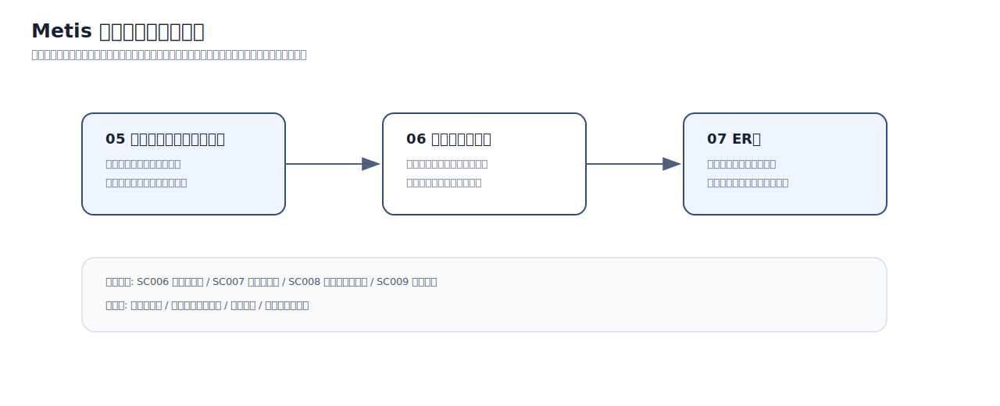

# 設計範囲

## 本資料の位置づけ

本資料は、Metis のコア体験について、画面設計とデータ設計の対応関係を整理したものです。  
対象は、利用者が学習ゴールを入力し、AIが学習ガイドを生成し、そのガイドを進め、完了後に教材化するまでの一連の流れです。

以下の3点を中心に扱います。

1. 画面をどのまとまりで部品化するか。
2. 画面ごとにどのデータを表示・入力・保存するか。
3. そのデータを支えるテーブル構造が成立しているか。

---

## 確認順序

画像ファイル: [サイトで開く](../assets/review/core-review-flow.svg) / [GitHubで確認](https://github.com/5B-Projects/review_Repository/blob/main/docs/assets/review/core-review-flow.svg)

| 順番 | 資料 | 内容 | 次の資料とのつながり |
|---|---|---|---|
| 1 | 05 コンポーネントツリー図 | 画面をReactコンポーネントとしてどの単位に分けるか | コンポーネントごとに必要な表示・入力データを洗い出す |
| 2 | 06 画面データ要求 | 画面で表示する値、利用者が入力する値、保存・更新する値を整理する | 保存・更新される値をER図のエンティティへ対応させる |
| 3 | 07 ER図 | 画面データ要求を支えるテーブル、PK/FK、リレーションを整理する | コア体験のデータ正本を確認する |

---

## 対象画面

| 画面ID | 画面名 | この資料で扱う理由 | 主な論点 |
|---|---|---|---|
| SC006 | ガイド生成 | Metis の入口となるゴール入力とAI生成を扱うため | 入力下書き、タグ選択、学習スタイル、生成ジョブ、構成案、安全性検査 |
| SC007 | ガイド進行 | 学習体験、AI相談、コード評価が集中するため | 章・ステップ、進捗、AI相談、評価ジョブ、評価結果 |
| SC008 | 学習ガイド終了 | 完了結果と教材化の境界を決めるため | 完了記録、AI評価サマリー、改善提案、教材化ジョブ |
| SC009 | 教材詳細 | 教材化された成果物の閲覧・学習導線を扱うため | 教材本体、教材版、目次、レビュー、学習開始、作者操作 |

---

## コア体験のデータの流れ

| 段階 | 利用者の操作 | システム側で起きること | 主なデータ |
|---|---|---|---|
| 1. ゴール入力 | 作りたいものを入力し、タグや学習方針を選ぶ | 入力内容を下書きとして保持し、安全性を確認する | ゴール下書き、選択タグ、学習スタイル |
| 2. ガイド生成 | 構成案を確認し、AI生成を開始する | 非同期ジョブを作成し、AI実行とガードレール検査を行う | ジョブ、生成ジョブ詳細、AI実行、検査結果、構成案 |
| 3. ガイド進行 | 章・ステップを読み進める | 現在位置と完了状態を保存する | 学習ガイド、章、ステップ、ガイド進捗、章進捗、ステップ進捗 |
| 4. AI相談・評価 | 質問やコード評価を実行する | ガイド進捗に紐づけて相談履歴と評価結果を保存する | AI相談メッセージ、評価ジョブ、評価結果 |
| 5. ガイド完了 | 学習を完了する | 完了記録とAI評価サマリーを作成する | ガイド完了記録、AI評価サマリー |
| 6. 教材化 | 完了したガイドを教材化する | 教材化ジョブを作成し、教材本体・教材版・目次を生成する | 教材化ジョブ、教材、教材版、教材セクション、教材チャプター |

---

## 対象外の範囲

| 範囲 | 扱い |
|---|---|
| 課金・決済 | 教材購入には必要だが、本資料では教材閲覧までのコア構造に絞る |
| 管理者・監査ログ | 運用設計として別資料で扱う |
| 組織管理 | 将来拡張として扱い、コア体験から切り離す |
| 通知・フォロー・お気に入り | 利便性機能として扱い、主要導線には含めない |

---

## 画像ファイルの扱い

画像は `review_Repository` の `docs/assets/` 配下に配置します。

| 配置先 | 用途 |
|---|---|
| `docs/assets/review/` | 資料構成や全体方針の図 |
| `docs/assets/component-tree/` | 説明用に整理したコンポーネントツリー図 |
| `docs/assets/er/` | 説明用に整理したER図・ER概要図 |
| `docs/assets/metis/` | `metis` リポジトリで実際に使用している画像 |

ページ上の画像はクリックで拡大表示できます。  
各画像の直下に、サイト上の画像ファイルとGitHub上の実ファイルへのリンクを置いています。
